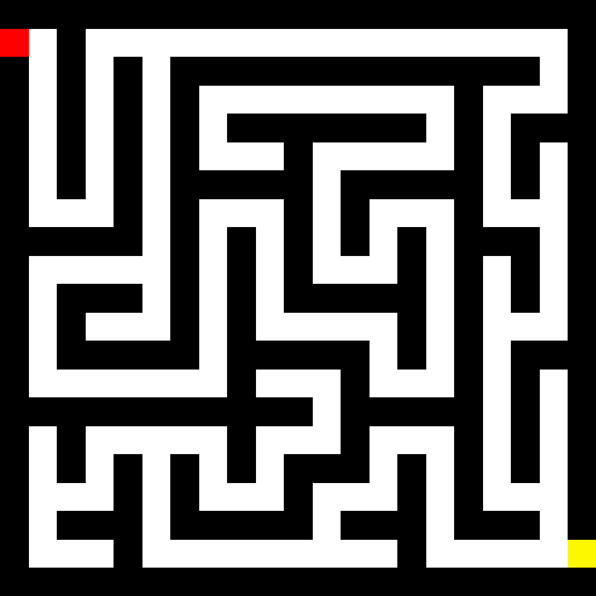
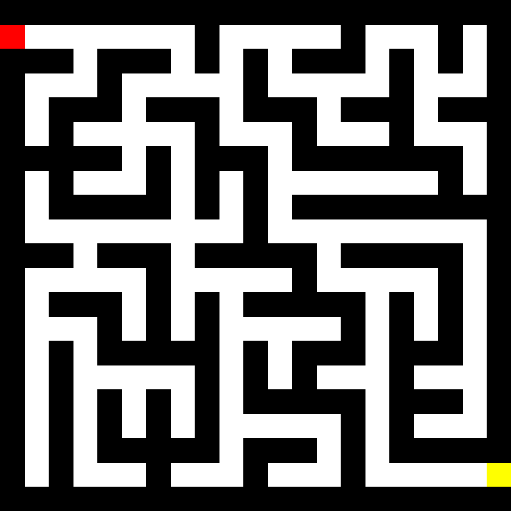
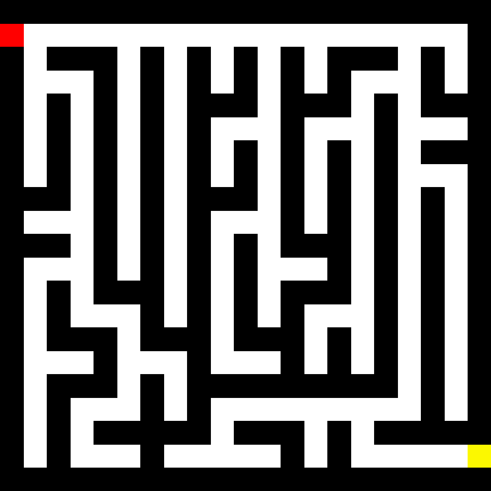
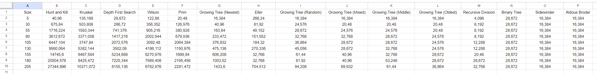

# Lapyrinth


<p align="center">
    
</p>

This **Mazer Maker Solver** made entirely in Python is a program where you can generate maze with many different algorithm and solving them with different pathfinders. Nothing more, nothing less.

## Summary

### 1. [Features](#1---features)

### 2. [Installation](#2---installation)

### 3. [Generate a maze](#3---generate-a-maze)

### 4. [Example of mazes](#4---example-of-mazes)

### 5. [Save a maze](#5---save-a-maze)

### 6. [Load a maze](#6---load-a-maze)

### 7. [Solve a maze](#7---solve-a-maze)

### 8. [Maze Generation Benchmarks](#8---maze-generation-benchmarks)

### 9. [Pathfinders Benchmarks](#8---pathfinders-benchmarks)

## 1 - Features

- Generate any maze of any size

- Choose different algorithms from 11 of them (and more with different parameters)

- Generate an image of the maze generated

- Save the maze to load it later

- Solve them with different pathfinders

- Ability to benchmark all algorithms in one click

## 2 - Installation

To begin, download and uncompress the **[latest version](https://github.com/Pietot/Maze-Maker-Solver/archive/refs/heads/main.zip)** or clone it by using one of the following command:

```
https://github.com/Pietot/Maze-Maker-Solver.git
```

or

```
git@github.com:Pietot/Maze-Maker-Solver.git
```

Then, you need to install all dependencies by opening a CLI (command line interface) and write these lines

```
cd "{the path to the project directory}"
pip install -r requirements.txt
```

## 3 - Generate a maze

To generate your first maze, write these lines at the end of <a href="https://github.com/Pietot/Maze-Maker-Solver/blob/main/maze.py">maze.py</a>:

```python
# Optional
start = (1, 7)
end = (5, 9)
# Or Maze(x) for a maze of x*x cells
maze = Maze(x, y, start, end)
# Choose the algorithm you want below
maze.binary_tree()
# If you want to make a so-called imperfect maze.
# You can specify the number of wall to removed
# or the probability that a wall will be removed
maze.make_imperfect_maze("number", 5)
# If you want to print the maze in the CLI
print(maze)
# If you want to generate a .png file of the maze
maze.generate_image()
```

or write the same lines in another python file in the same directory as <a href="https://github.com/Pietot/Maze-Maker-Solver/blob/main/maze.py">maze.py</a> but with an import at the beginning of the file like this:

```python
from maze import Maze

# Optional
start = (1, 7)
end = (5, 9)
# Or Maze(x) for a maze of x*x cells
maze = Maze(x, y, start, end)
# Choose the algorithm you want below
maze.binary_tree()
# If you want to make a so-called imperfect maze.
# You can specify the number of wall to removed
# or the probability that a wall will be removed
maze.make_imperfect_maze("number", 5)
# If you want to print the maze in the CLI
print(maze)
# If you want to generate a .png file of the maze
maze.generate_image()
```

> **Note**: Obviously, the larger the maze, the longer it will take to create and generate the image.

## 4 - Example of mazes

That's it. See, it's very simple. You can go with all of these algorithms:

- Kruskal

<br><br>

- Randomized Depth First Search

<br><br>

- Prim

<br><br>

- Hunt and Kill

<br><br>

- Eller (may vary depending on parameters)

<br><br>

- Iterative Division

<br><br>

- Binary Tree (may vary depending on parameters)

<br><br>

- Sidewinder (may vary depending on parameters)

&nbsp;&nbsp;&nbsp;&nbsp;&nbsp;&nbsp;
<br><br>

- Growing Tree (may vary depending on parameters)

&nbsp;&nbsp;&nbsp;&nbsp;&nbsp;&nbsp;
&nbsp;&nbsp;&nbsp;&nbsp;&nbsp;&nbsp;

<br><br>

- Aldous-Broder

<br><br>

- Wilson

<br><br>

## 5 - Save a maze

If you want to save the maze you've created, three options are available to you:

#### - Save the entire object:

```py
# Filename is optional
filename = "maze_object"
maze.save_maze("pkl", filename)
```

Benefits / Inconveniences:

- Saves all the data of the maze
- Can't be edited
- Easier to load
- Heavy file (~ 15Mo for a 1000x1000 cell maze)

#### - Save the maze's array as a binary file:

```py
# Filename is optional
filename = "maze_binary"
maze.save_maze("npy", filename)
```

Benefits / Inconveniences:

- Only saves the maze's array
- Can't be edited
- Fast to load
- Heavy file (~ 15Mo for a 1000x1000 cell maze)

#### - Save the maze's array as a text file:

```py
# Filename is optional
filename = "maze_text"
maze.save_maze("txt", filename)
```

Benefits / Inconveniences:

- Only saves the maze's array
- Easy to read and edit
- Slow to load
- Light file (~ 7.5Mo for a 1000x1000 cell maze)

## 6 - Load a maze

If you want to load the maze you've saved, two options are available to you depending on the file format:

#### - Load a .pkl file:

```py
from maze import load_object

maze = load_object("maze_object.pkl")
```

#### - Load a .npy or a .txt file:

```py
from maze import Maze

maze = Maze()
maze.load_maze("maze_binary.npy")
# Or
maze.load_maze("maze_text.txt")
```

> **Note**: The file must be in the same directory as the script or you must specify the path to the file.

## 7 - Solve a maze

Here's the code to follow to solve a maze:

```py
from maze import Maze

import pathfinders

maze = Maze(10)
maze.prim()
path = pathfinders.depth_first_search(maze)
# If you want to print the solved maze in the CLI
pathfinders.print_path(maze, path)
# If you want to generate a .png file of the solved maze
pathfinders.generate_path(maze, path)
```

Example of a solved maze:

<br>

Here are all the pathfinders available:

- Right Hand Rule
- Left Hand Rule
- Random Mouse
- Pledge
- Dead End Filler
- Depth First Search
- Breadth First Search
- Best First Search
- A\*

## 8 - Maze Generation Benchmarks

Wonder which algorithm is **faster**? Or which one is less **memory intensive**?

Well.. I already did it for you! So here you are:


> **Note**: For the generation time, I deliberately excluded Aldous-Broder and Wilson algorithms because they are truly random (""luck"" based in other words), so they are very inconsistent on a generation to another.

If you want the values of these graphs with Aldous-Broder and Wilson algorithms, watch this:


<a href="assets/csv/time_complexity.csv">Download csv here</a><br><br>


<a href="assets/csv/memory_complexity.csv">Download csv here</a><br><br>

If you want to benchmark these algorithms yourself:

- Download the benchmark file <a href="https://github.com/Pietot/Maze-Maker-Solver/blob/main/benchmark_generation_algorithm.py">here</a> and put it in the same folder as <a href="https://github.com/Pietot/Maze-Maker-Solver/blob/main/maze.py">maze.py</a>

- Edit the benchmark file for your needs:<br>
  line 216/218 and 273/275 change the max size of the maze like you want and adapt the step in the for loop.

- Run the script

> **Note**: Keep in mind that the lower the step is, the more precision/values ​​you will have, but the longer the script will take, and vice versa if the step is high.<br><br>
> These values can change depending on the version of Python and your PC<br><br>
> For these benchmarks, I used Python 3.12.0 on a ryzen 5 3600, rtx 2060 with 2\*8GB of RAM clocked at 3600Hz on Windows 10

## 8 - Pathfinders Benchmarks

Wonder which pathfinder is the most **efficient**? Or which one is less **memory intensive**?

Well.. I already did it for you! So here you are:
