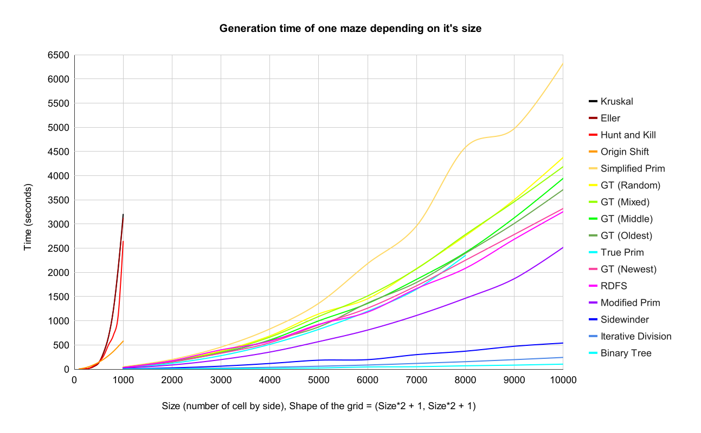
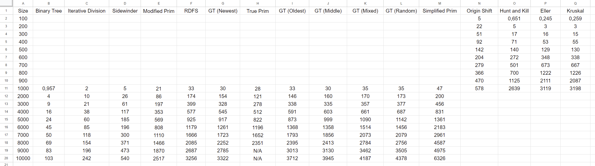

# Lapyrinth


Lapyrinth is a package made entirely in Python where you can generate mazes with many different algorithms and solving them with different pathfinders. Nothing more, nothing less.

## Summary

### 1. [Features](#1---features)

### 2. [Installation](#2---installation)

### 3. [Generate a maze](#3---generate-a-maze)

### 4. [Example of mazes](#4---example-of-mazes)

### 5. [Save a maze](#5---save-a-maze)

### 6. [Load a maze](#6---load-a-maze)

### 7. [Solve a maze](#7---solve-a-maze)

### 8. [Maze Generation Benchmarks](#8---maze-generation-benchmarks)

### 9. [Pathfinders Benchmarks](#9---pathfinders-benchmarks)

### 10. [Improve the project](#10---improve-the-project)

## 1 - Features

- Generate any maze of any size

- Choose different algorithms from 14 of them (and more with different parameters)

- Generate an image of the maze generated

- Save the maze to load it later

- Solve them with various pathfinders among 10 of them

- Generate an image of the maze solved

## 2 - Installation

To begin, two options are available to you:

The first and easiest way is to install the package with pip by writing this line in a CLI (command line interface).

```
pip install lapyrinth
```

And that's it, you're ready to go to step 3.

---

The second and harder way is download and uncompress the **[latest version](https://github.com/Pietot/Maze-Maker-Solver/archive/refs/heads/main.zip)**, or clone it by using one of the following command:

```
git clone https://github.com/Pietot/Maze-Maker-Solver.git
```

or

```
git clone git@github.com:Pietot/Maze-Maker-Solver.git
```

Then, you need to install all dependencies by opening a CLI (command line interface) and write these lines

```
cd "{the path to the project directory}"
pip install -r requirements.txt
```

## 3 - Generate a maze

To generate your first maze, write these lines in any python file:

```python
from lapyrinth import Maze

height = 9
width = 16
# Optional
start = (1, 7)
end = (5, 9)
# Or Maze(x) for a maze of x*x cells
maze = Maze(height, width, start=start, end=end)
# Choose the algorithm you want below
maze.binary_tree()
# If you want to make a so-called imperfect maze.
# You can specify the number of wall to removed
# or the probability that a wall will be removed
maze.make_imperfect_maze("number", 5)
# If you want to print the maze in the CLI
print(maze)
# If you want to generate a .png file of the maze
maze.generate_image()
```

If you've downloaded the project, write the same lines in a new python file inside <a href="https://github.com/Pietot/Lapyrinth/tree/main/lapyrinth">lapyrinth</a> folder:

> **Note**: Obviously, the larger the maze, the longer it will take to create and generate the image.

## 4 - Example of mazes

That's it. See, it's very simple. You can go with all of these algorithms:

- Aldous-Broder
<p align="center">
    
    
    <br>
    <br>
</p>

- Binary Tree (may vary depending on parameters)
<p align="center">
    
    
    <br>
    <br>
</p>

- Eller (may vary depending on parameters)
<p align="center">
    
    
    <br>
    <br>
</p>

- Growing Tree (may vary depending on parameters)
<p align="center">
    
    
    <br>
    <br>
</p>

- Hunt and Kill
<p align="center">
    
    
    <br>
    <br>
</p>

- Iterative Division
<p align="center">
    
    
    <br>
    <br>
</p>

- Kruskal
<p align="center">
    
    
    <br>
    <br>
</p>

- Modified Prim
<p align="center">
    
    
    <br>
    <br>
</p>

- Randomized Depth First Search
<p align="center">
    
    
    <br>
    <br>
</p>

- Sidewinder (may vary depending on parameters)
<p align="center">
    
    
    <br>
    <br>
</p>

- Simplified Prim
<p align="center">
    
    
    <br>
    <br>
</p>

- True Prim
<p align="center">
    
    
    <br>
    <br>
</p>

- Origin Shift
<p align="center">
    
    
    <br>
    <br>
</p>

- Wilson
<p align="center">
    
    
    <br>
    <br>
</p>

## 5 - Save a maze

If you want to save the maze you've created, three options are available to you:

#### - Save the entire object:

```py
from lapyrinth import Maze

maze = Maze(10)
maze.prim()

# Filename is optional
filename = "maze_object.pkl"
maze.save(filename)
```

Pros / Cons:

- Saves all the data of the maze
- Can't be edited
- Easy to load
- Heavy file (~15Mo for a 1000x1000 cell maze)

#### - Save the maze's array as a binary file:

```py
from lapyrinth import Maze

maze = Maze(10)
maze.prim()

# Filename is optional
filename = "maze_numpy.npy"
maze.save(filename)
```

Pros / Cons:

- Only saves the maze's array
- Can't be edited
- Fast to load
- Heavy file (~15Mo for a 1000x1000 cell maze)

#### - Save the maze's array as a text file:

```py
from lapyrinth import Maze

maze = Maze(10)
maze.prim()

# Filename is optional
filename = "maze_text.txt"
maze.save(filename)
```

Pros / Cons:

- Only saves the maze's array
- Easy to read and edit
- Slow to load
- Light file (~7.5Mo for a 1000x1000 cell maze)

## 6 - Load a maze

If you want to load the maze you've saved, follow the code below:

```py
from lapyrinth import Maze

maze_object = Maze.load("maze_object.pkl")
# Or
maze_numpy = Maze.load("maze_numpy.npy")
# Or
maze_text = Maze.load("maze_text.txt")
```

> **Note**: The file must be in the same directory as the script or you must specify the path to the file.

## 7 - Solve a maze

Here's the code to follow to solve a maze:

```py
from lapyrinth import Maze, pathfinders

maze = Maze(10)
maze.iterative_division()
path = pathfinders.depth_first_search(maze)
# If you want to print the solved maze in the CLI
pathfinders.print_path(maze, path)
# If you want to generate a .png file of the solved maze
pathfinders.generate_path(maze, path)
```

Here are all the pathfinders available:

- Right Hand Rule
<p align="center">
     
    <br>
    <br>
</p>

- Left Hand Rule
<p align="center">
     
    <br>
    <br>
</p>

- Random Mouse
<p align="center">
     
    <br>
    <br>
</p>

- Pledge (may vary depending on parameters)
<p align="center">
     
    <br>
    <br>
</p>

- Dead End Filler
<p align="center">
     
    <br>
    <br>
</p>

- Depth First Search
<p align="center">
     
    <br>
    <br>
</p>

- Breadth First Search and Dijkstra
<p align="center">
     
    <br>
    <br>
</p>

- Greedy Best First Search
<p align="center">
     
    <br>
    <br>
</p>

- A\*
<p align="center">
     
    <br>
    <br>
</p>

## 8 - Maze Generation Benchmarks

Wonder which algorithm is **faster**?

Well.. I already did it for you! So here you are:

- Chart for slow algorithms:

<br><br>

- Chart for moderately fast algorithms:

<br><br>

- Chart for fast algorithms:

<br><br>

- Chart for all algorithms:

<br><br>

> **Note**: Aldous-Broder and Wilson algorithms were not tested because they are truly random (""luck"" based in other words), so their times are very inconsistent on a generation to another. But for an idea, they are even slower than Kruskal's algorithm.

If you want the values of these graphs, watch this:


<p align="center">
<a href="assets/csv/maze_generation_time.csv">Download csv here</a>
</p>

> **Note**: These values can change depending on the version of Python and your PC<br><br>
> For these benchmarks, I used Python 3.12.0 implemented with CPython on a ryzen 5 3600, rtx 2060 with 2\*8GB of RAM clocked at 3600Hz on Windows 10.<br>
> These benchmarks were all tested at the same time (multiprocessing) so the results are higher than if they were tested one by one.
> Benchmarks were made on the version 1.15

## 9 - Pathfinders Benchmarks

Wonder which pathfinder is the most **efficient**?

Well.. I also already did it for you! So here you are:

> **Note** For better comparison, I used the same maze with default start/end for all pathfinders, for all size. Moreover, I used one set of mazes generated with RDFS (algorithm with the lowest dead-end rate) and another set of mazes generated with Kruskal (algorithm with the highest dead-ends rate). They're all available in the <a href="assets/pkl">pkl directory</a>.

- Chart for fast pathfinders on RDFS mazes:

<br><br>

- Chart for all pathfinders on RDFS mazes:

<br><br>

- Chart for fast pathfinders on Kruskal mazes:

<br><br>

- Chart for all pathfinders on Kruskal mazes:

<br><br>

If you want the values of these graphs, watch this:


<p align="center">
<a href="assets/csv/pathfinder_time.csv">Download csv here</a>
</p>

> **Note**: These values can change depending on the version of Python and your PC<br><br>
> For these benchmarks, I used Python 3.12.0 implemented with CPython on a ryzen 5 3600, rtx 2060 with 2\*8GB of RAM clocked at 3600Hz on Windows 10.

## 10 - Improve the project

If you like this project and/or want to help or improve it, you can:

- Create an issue if you find a bug or want to suggest a feature or any improvement (no matter how small it is).

- Create a pull request if you want to add a feature, fix a bug or improve the code.

- Contact me if you want to talk about the project or anything else (Discord: pietot).

> **Note**: If you want to be guided/helped, you already have a file named <a href="IMPROVEMENT.txt">IMPROVEMENTS.txt</a> in the project directory, where you can see all the improvements that can be made.
